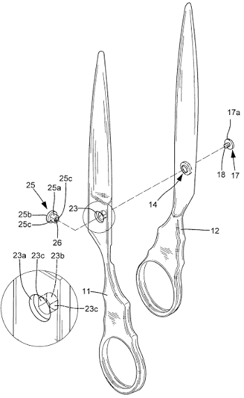

# A1 – [Create Portfolio]

## Objective (Part 1)
The objective of this analysis is to evaluate two engineering portfolios based on four functional requirements: navigability, reproducibility, evidence of reasoning, and professional tone.

## Portfolio Analysis (Task A)

### Portfolio 1: Ikbal Nayem (GitHub)

**Source:** [Ikbal Nayem GitHub Portfolio](https://github.com/ikbal-nayem/ikbal-nayem)

#### A. Navigability

Ikbal’s portfolio is relatively efficient to navigate because of its simple GitHub-based layout. The information is divided into sections such as About Me, Tech Stack, Recent Projects, Certifications, and Contact. The Recent Projects section allows a reader to quickly locate projects such as English Tutor AI and BD Law AI. However, the portfolio relies heavily on scrolling, and some sections provide limited information about what can be found within them. Overall, a reader can locate the major areas of Ikbal’s work quickly, but more detailed project organization could reduce searching time.

#### B. Reproducibility

Ikbal’s portfolio provides enough information to understand the general purpose and technologies used in his projects, but not enough to fully reproduce the work without additional questions. For example, the English Tutor AI project explains its functions and identifies technologies such as OpenRouter and React. However, it does not provide detailed procedures, design constraints, or testing information. Therefore, the portfolio only partially satisfies the reproducibility requirement.

#### C. Evidence of Reasoning

Ikbal’s portfolio provides more information about the final products than the reasoning behind their development. For example, the English Tutor AI project explains its grammar correction, conversation simulation, and fluency tracking features, but does not explain what design requirements led to these features, what alternatives were considered, or what problems were encountered. Additional information about design decisions, testing, revisions, and tradeoffs would provide stronger evidence of the engineering process.

#### D. Professional Tone

Ikbal’s portfolio uses concise and appropriate language for a workplace setting. It focuses on his technical experience, projects, certifications, and skills without unnecessary wording. It also uses technical terminology such as RAG, PWA, React, OpenRouter API, ChromaDB, and LangChain. This makes the portfolio appropriate for an employer or technical reviewer evaluating his qualifications.

---

### Portfolio 2: Thanh Tran

**Source:** [Thanh Tran Portfolio](https://thanhvtran.com/)

#### A. Navigability

Thanh’s portfolio uses graphical elements and animations to create a personal website experience. Because of the amount of information included, a reader may not locate every piece of work within the first 60 seconds. However, the website has separate tabs for his resume, projects, about section, and contact information. The project section also separates each project into its own page with structured information. Overall, the major sections are easy to access, although the amount of content can increase the time needed to locate specific work.

#### B. Reproducibility

Thanh provides extensive information about his projects, with each project organized into its own section. The descriptions provide useful information about the purpose and technical work involved, such as tolerance stack-up analysis, fixture design, and finite element analysis. However, the portfolio does not consistently provide enough calculations, procedures, design files, or testing data for a colleague to reproduce the work without asking additional questions. Therefore, it partially satisfies the reproducibility requirement.

#### C. Evidence of Reasoning

Thanh provides strong evidence of reasoning throughout his projects. His portfolio explains what was done and, in many cases, why the work was necessary. For example, his Boeing experience describes redesigning and performing finite element analysis on a gear for wing actuation, while his Blue Origin experience explains how tolerance stack-up analysis and fixture design were used to improve assembly. These descriptions provide context for the engineering decisions rather than only presenting the final results.

#### D. Professional Tone

Thanh’s portfolio uses a mix of informal and technical language. His About section includes jokes such as being “addicted to machining” and references to laptop problems, which gives the site a personal identity but may distract from his qualifications when first viewed. However, his experience and project sections use technical and workplace-appropriate language when describing his engineering work. Overall, the technical sections maintain an appropriate tone for an employer or engineering reviewer.

## Final Thoughts

Based on the comparison, both portfolios satisfy the basic requirements for presenting engineering experience, but they have different strengths. Ikbal’s portfolio is simpler to navigate and presents information efficiently, while Thanh’s portfolio provides more detailed project information and stronger evidence of engineering reasoning. Both could improve their reproducibility by including more detailed procedures, calculations, testing results, and design files.

For my own portfolio, I will focus on organizing projects so they can be located quickly while also documenting the reasoning behind my engineering decisions. I will include not only the final result, but also the process, calculations, design changes, and results of testing when applicable.

## Product Analysis (Task B)
## Primary Function

The primary function of scissors is to convert an applied hand force into a concentrated shearing force that separates a material along a defined cutting path.

The user applies force to the handles, producing rotational motion around the pivot. This causes the two blades to move relative to one another. The blades then apply opposing forces to the material, creating shear that causes the material to separate.

---

## Governing Model

The primary mechanical behavior of scissors can be modeled using **torque** and **shear stress**.

### Torque

The torque produced around the pivot can be represented by:

[
τ = Fr
]

Where:

- `τ` = Torque
- `F` = Force applied to the handle
- `r` = Perpendicular distance from the pivot to the applied force

A longer handle creates a larger moment arm, allowing the user to produce greater torque with the same applied force.

### Shear Stress

The cutting action can also be related to shear stress:

[
τ = \frac{F}{A}
]

Where:

- `τ` = Shear stress
- `F` = Cutting force
- `A` = Area being sheared

The sharp edges of the scissors concentrate the cutting force over a relatively small area, increasing the resulting shear stress.

### Assumptions

The analysis assumes that:

1. The pivot acts as a fixed rotational point.
2. The handles and blades remain approximately rigid while force is applied.
3. The applied hand force acts perpendicular to the handle for maximum torque.
4. Friction at the pivot is neglected.
5. The blades remain in contact with the material during cutting.

These assumptions allow the applied hand force to be analyzed as a rotational force around the pivot.

---

## Component Geometry

### Component 1 — Blade and Handle Assembly #1

The first blade has a long, tapered cutting edge that becomes thinner toward the tip.

This geometry concentrates the applied force along a small cutting edge, allowing the blade to penetrate and shear the material.

The handle is longer than the cutting portion, increasing the distance between the user's applied force and the pivot. This increases the torque produced around the pivot.

### Component 2 — Blade and Handle Assembly #2

The second blade mirrors the first and works against it to produce the shearing action.

The angled cutting edge allows the blades to maintain contact progressively along the material rather than attempting to cut the entire width simultaneously.

The handle provides a large moment arm around the pivot, reducing the hand force required to generate the necessary cutting torque.

### Component 3 — Pivot Fastener

The pivot fastener connects the two blade assemblies while allowing them to rotate relative to one another.

Its position near the intersection of the blades establishes the rotational axis.

Keeping the pivot close to the cutting edges allows the applied handle force to be transferred through the blades while maintaining controlled movement between them.

---

## Mechanical System

## Decide Pillar (Part 2)

The **Decide Pillar** focuses on making intentional choices, documenting the reasoning behind those choices, and establishing a professional standard for the work that follows.

---

## 1. Homepage Identity

The homepage will clearly communicate that this portfolio is a professional engineering record containing documented coursework, engineering projects, analyses, and technical development throughout the semester.

The content will be organized through consistent navigation so that a visitor, particularly an instructor, engineering professional, or potential employer, can quickly understand the purpose of the portfolio and locate specific work without unnecessary searching.

The homepage will emphasize the **quality and organization of the work** rather than personal information, since the About Me section provides that context. This approach allows the portfolio to function as a professional documentation system that demonstrates both the engineering work completed and the process used to develop and communicate that work.

---

## 2. One Intentional Customization

I will remove the existing **MEGR title card** from the portfolio template and replace it with a design element that represents my professional and creative approach to engineering.

This change is intended to make the portfolio more adaptable to the type of engineering work I plan to document while still maintaining the template's required structure and navigation.

As I continue developing as an engineer, I will need additional project pages and space for more detailed documentation than the initial portfolio template provides. Replacing the title card therefore better satisfies the requirement for the portfolio to serve as a **scalable professional engineering record** while maintaining the existing organizational structure.

---

## 3. Documentation Standard

> **For every assignment entry this semester, I will maintain a professional standard of documentation by clearly explaining my engineering decisions, supporting them with appropriate evidence and technical reasoning, and organizing each submission so that another reader can understand the work without needing additional explanation.**

---

## Professional Goal

Beyond completing individual assignments, I intend to use this portfolio to stay informed about upcoming assignments, course requirements, and important deadlines. Maintaining awareness of what is expected will allow me to plan my time effectively, stay ahead of the course schedule, and produce the highest-quality work possible within the time available.

This approach will allow the portfolio to develop throughout the semester rather than functioning only as a collection of completed assignments. Each entry will contribute to a larger professional record of my development as an engineer.

---

## Summary

| Decision | Choice | Purpose |
|---|---|---|
| **Homepage Identity** | Professional engineering record | Allow visitors to quickly understand and navigate the portfolio |
| **Customization** | Replace MEGR title card | Create a more professional, creative, and scalable portfolio design |
| **Documentation Standard** | Clear reasoning, evidence, and organization | Ensure every assignment meets a consistent professional quality standard |
| **Professional Goal** | Stay ahead of assignments and requirements | Improve planning, consistency, and quality of work |

## Communicate

